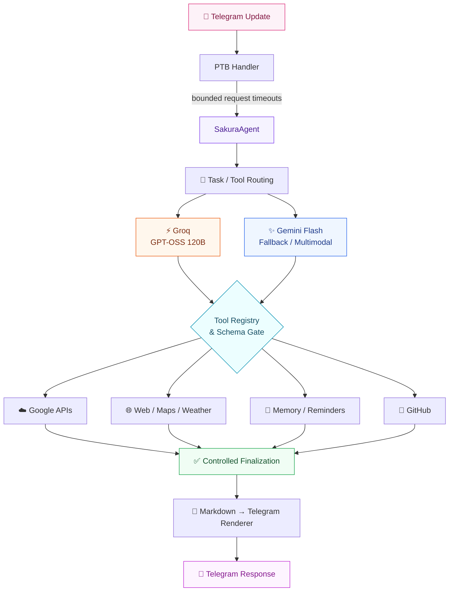

# Sakura AI 🌸

### Free-tier AI agent runtime for Telegram

*A personal-assistant style Telegram bot with bounded LLM/tool orchestration, Google & GitHub integrations, free web utilities, memory, reminders, and a reliability-focused runtime.*

  
  
  
  
  

  <a href="#-what-is-sakura-ai">What is Sakura?</a>
  •
  <a href="#-architecture">Architecture</a>
  •
  <a href="#-capabilities">Capabilities</a>
  •
  <a href="#-security--reliability">Security</a>
  •
  <a href="#-setup">Setup</a>
  •
  <a href="#-validation">Validation</a>

---

## 🌸 What is Sakura AI?

**Sakura AI** is a Telegram personal-assistant runtime designed around a simple idea:

> **Use free-tier AI services, keep tool execution deterministic, and make failures easier to isolate and debug.**

Instead of putting every request through one giant model/tool loop, Sakura routes a message through a bounded agent runtime, selects only relevant tools, validates their arguments, executes side effects only when the user's intent is explicit, and then produces a controlled final response.

### Why this repository is interesting

| Area | What Sakura demonstrates |
|---|---|
| 🤖 Agent systems | LLM + tool orchestration with explicit routing |
| 🧰 Tool calling | JSON-schema validation, prerequisite lookup IDs, capped tool subsets |
| 🔐 Security | SSRF protection, side-effect guards, prompt-injection hardening |
| ⚡ Reliability | Async provider calls, bounded timeouts, provider-level failover |
| 🧠 Memory | Persistent assistant state backed by MongoDB |
| 🔌 Integrations | Google services, GitHub, web/maps/weather utilities |
| 📱 UX | Telegram-native responses, thinking feedback, Markdown rendering |
| 💸 Cost control | Free-tier-first provider/runtime design |

---

## ✨ Highlights

<strong>🤖 Multi-provider LLM runtime</strong>

- **Groq — `openai/gpt-oss-120b`** for primary text/tool orchestration.
- **Google Gemini API — `gemini-3.8-flash`** for fallback and multimodal document/image analysis.
- Groq quota failures are treated as **provider-level failures** and routed to Gemini rather than repeatedly retrying the same free-plan quota wall.
- Finalization is kept **tool-free and structured** so the runtime can produce a deterministic final answer.

<strong>🧰 Tool-first agent design</strong>

Sakura does not expose every available tool on every request.

The runtime:

1. Detects the likely task.
2. Selects a small relevant tool subset.
3. Validates tool arguments against schemas.
4. Executes stateful workflows sequentially.
5. Finalizes the response without another uncontrolled tool call.

This keeps stateful workflows predictable and reduces unnecessary tool traffic.

<strong>🔐 Security & trust boundaries</strong>

- Task-local Telegram state is stored with `contextvars`.
- Tool arguments are JSON-schema validated before execution.
- Lookup IDs require provenance from prerequisite tools in the same request.
- Side-effecting tools require clear user intent.
- Saved profiles, notes, webpages, files, emails, and tool results are treated as **data, not instructions**.
- URL-fetching blocks loopback/private/link-local/reserved destinations and validates redirects.
- Credential-bearing files are excluded from source control.

<strong>🌐 Free public services</strong>

The runtime uses free/public service paths for:

- DuckDuckGo HTML — web search
- Open-Meteo — weather and geocoding
- OpenStreetMap Nominatim — place search
- OSRM — directions/routing
- Gmail / Calendar / Drive / Docs — Google account OAuth APIs
- GitHub API — authenticated GitHub account operations

> **Free does not mean unlimited.** Public services still enforce their own usage policies and rate limits.

---

# 🏗️ Architecture

---

Sakura is more than a Telegram chatbot.

The repository demonstrates a practical **agent-runtime engineering** problem:

> How do you connect an LLM to real tools without letting model mistakes, provider failures, bad arguments, prompt injection, or slow network requests take down the whole assistant?

That makes the project relevant to areas such as:

- AI agent engineering
- backend development
- API integration
- asynchronous Python systems
- tool/function calling
- application security
- reliability engineering
- LLM orchestration

---

### 🌸 Sakura AI

**Free-tier services • Controlled tools • Safer agent execution**

Built as a reliability/security-focused Telegram assistant runtime.

